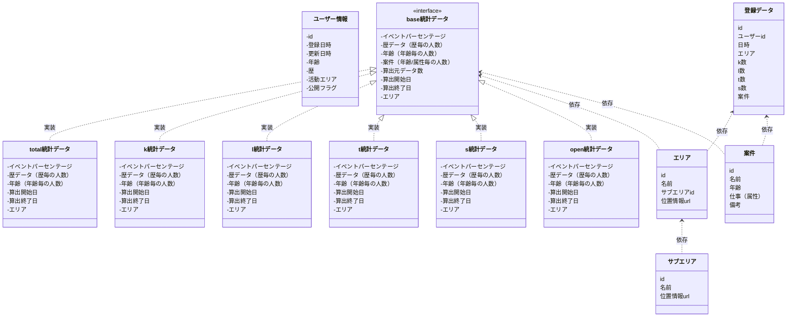

```mermaid
classDiagram
    class ユーザー情報 {
        -id
        -登録日時
        -更新日時
        -年齢
        -歴
        -活動エリア
        -公開フラグ
    }

    %%統計データ
    class base統計データ {
        <<interface>>
        -イベントパーセンテージ
        -歴データ（歴毎の人数）
        -年齢（年齢毎の人数）
        -案件（年齢/属性毎の人数）
        -算出元データ数
        -算出開始日
        -算出終了日
        -エリア
    }
    base統計データ <|.. total統計データ : 実装
    base統計データ <|.. k統計データ : 実装
    base統計データ <|.. l統計データ : 実装
    base統計データ <|.. t統計データ : 実装
    base統計データ <|.. s統計データ : 実装
    base統計データ <|.. open統計データ : 実装

    class total統計データ {
        -イベントパーセンテージ
        -歴データ（歴毎の人数）
        -年齢（年齢毎の人数）
        -算出開始日
        -算出終了日
        -エリア
    }
    class k統計データ {
        -イベントパーセンテージ
        -歴データ（歴毎の人数）
        -年齢（年齢毎の人数）
        -算出開始日
        -算出終了日
        -エリア
    }
    class open統計データ {
        -イベントパーセンテージ
        -歴データ（歴毎の人数）
        -年齢（年齢毎の人数）
        -算出開始日
        -算出終了日
        -エリア
    }
    class l統計データ {
        -イベントパーセンテージ
        -歴データ（歴毎の人数）
        -年齢（年齢毎の人数）
        -算出開始日
        -算出終了日
        -エリア
    }
    class t統計データ {
        -イベントパーセンテージ
        -歴データ（歴毎の人数）
        -年齢（年齢毎の人数）
        -算出開始日
        -算出終了日
        -エリア
    }
    class s統計データ {
        -イベントパーセンテージ
        -歴データ（歴毎の人数）
        -年齢（年齢毎の人数）
        -算出開始日
        -算出終了日
        -エリア
    }

    %% エリア系データ
    class エリア {
        id
        名前
        サブエリアid
        位置情報url
    }
    登録データ <.. エリア : 依存
    base統計データ <.. エリア : 依存

    class サブエリア {
        id
        名前
        位置情報url
    }
    エリア <.. サブエリア : 依存

    %%記録系データ
    class 登録データ {
        id
        ユーザーid
        日時
        エリア
        k数
        l数
        t数
        s数
        案件
    }
    class 案件 {
        id
        名前
        年齢
        仕事（属性）
        備考
    }
    登録データ <.. 案件 : 依存
    base統計データ <.. 案件 : 依存
```
