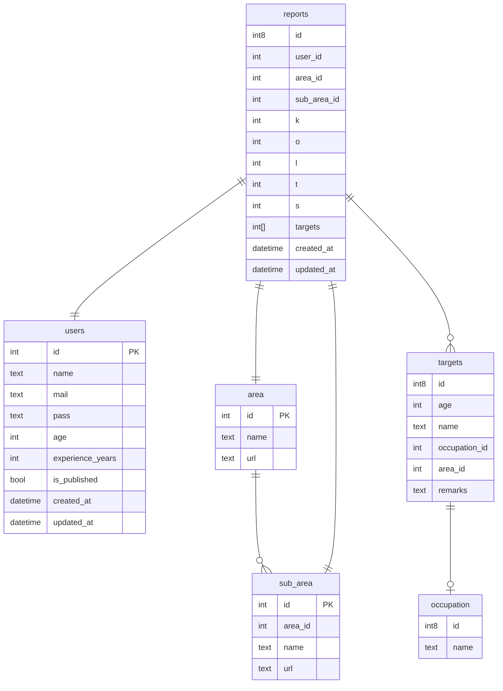

```mermaid
erDiagram
    users {
        int id PK
        text name
        text mail
        text pass
        int age
        int experience_years
        bool is_published
        datetime created_at
        datetime updated_at
    }

    area {
        int id PK
        text name
        text url
    }
    area ||--o{ sub_area : ""

    sub_area{
        int id PK
        int area_id
        text name
        text url
    }

    reports {
        int8 id
        int user_id
        int area_id
        int sub_area_id
        int k
        int o
        int l
        int t
        int s
        int[] targets
        datetime created_at
        datetime updated_at
    }
    reports ||--|| users : ""
    reports ||--|| area : ""
    reports ||--|| sub_area : ""
    reports ||--o{ targets : ""

    targets {
        int8 id
        int age
        text name
        int occupation_id
        int area_id
        text remarks
    }
    targets ||--o| occupation : ""

    occupation {
        int8 id
        text name
    }
```
